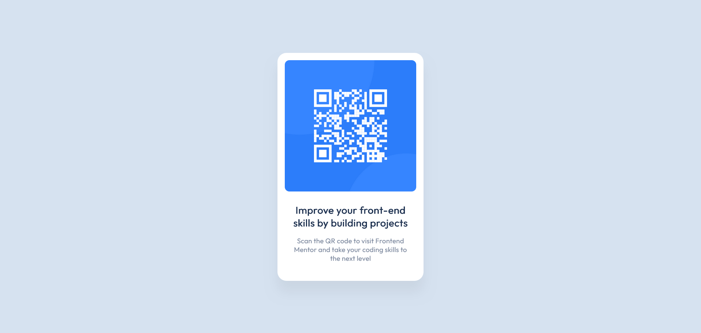

# Frontend Mentor - QR code component solution

This is a solution to the [QR code component challenge on Frontend Mentor](https://www.frontendmentor.io/challenges/qr-code-component-iux_sIO_H). Frontend Mentor challenges help you improve your coding skills by building realistic projects. 

## Table of contents

  - [Screenshot](#screenshot)
  - [Links](#links)
  - [Built with](#built-with)
  - [Author](#author)

### Screenshot

### Links

- Solution URL: [https://d-sisovic.github.io/QR-code]
- Live Site URL: [https://d-sisovic.github.io/QR-code]

### Built with

- Semantic HTML5 markup
- SCSS
- Flexbox
- Mobile-first workflow

### Author
Daniel Sisovic